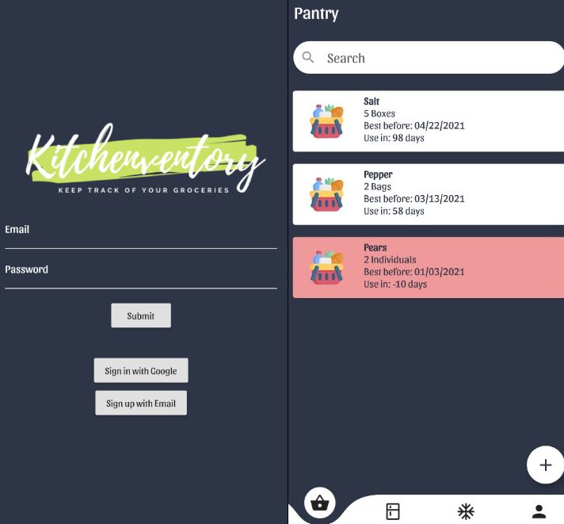

<h1 align = "center"> TracKitchen :man_cook: :woman_cook: </h1>

## Table of Contents
- [Introduction](#introduction)
- [Motivation](#motivation)
- [Developing](#developing)
- [Screenshot](#screenshot)
- [What's Next?](#what-is-next?)

## Introduction

TracKitchen is an inventory app that helps users to keep track of what's in their kitchen. Users are able to view their items categorized by 3 locations: pantry, freezer, and refrigerator.

## Motivation

This app assists in reducing food waste and makes keeping track of groceries easier, especially in a kitchen that is shared between multiple roommates. Knowing when groceries are expected to expire will help users to grab whatever they may need while they're out.

## Developing :fork_and_knife:

#### Built With:
- [Flutter](https://flutter.dev/)
- [Firebase](https://firebase.google.com/)
- [Spoonacular API](https://spoonacular.com/food-api)
    - Used to autofill food names and retrieve nutritional information

## Screenshot

## What is Next?
- Adding a clean up functionality that will automatically filter out expired foods
- Suggesting recipes based on what users currently have
